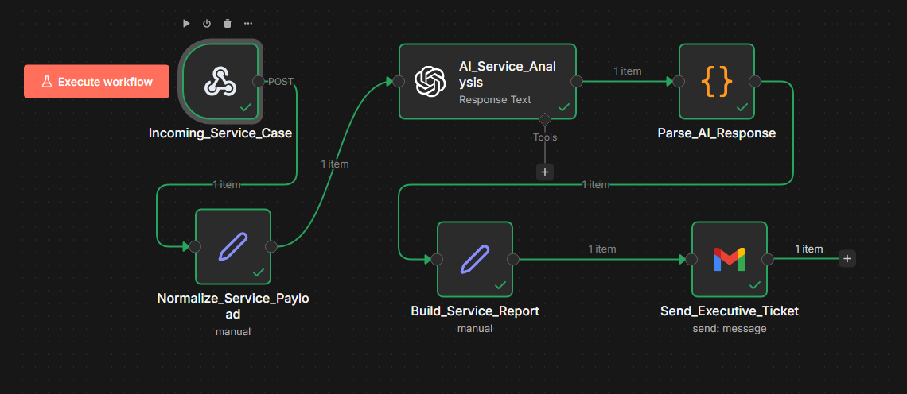
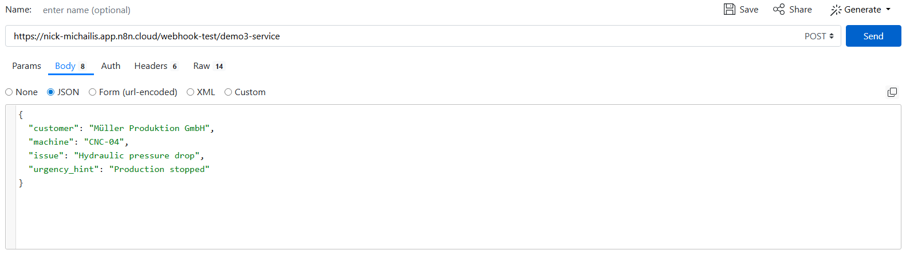
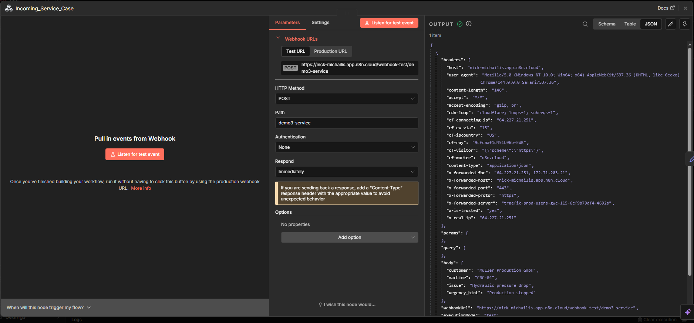
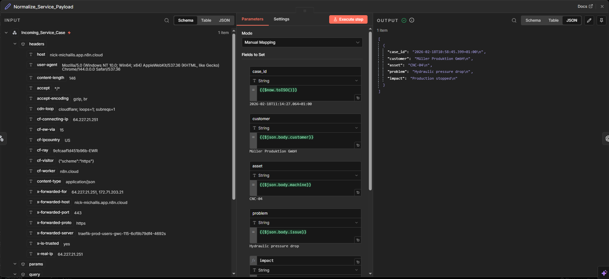
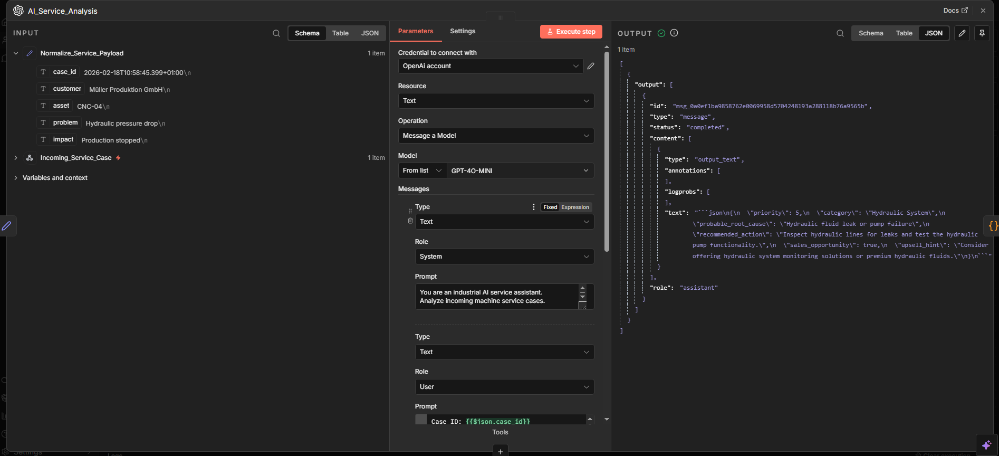
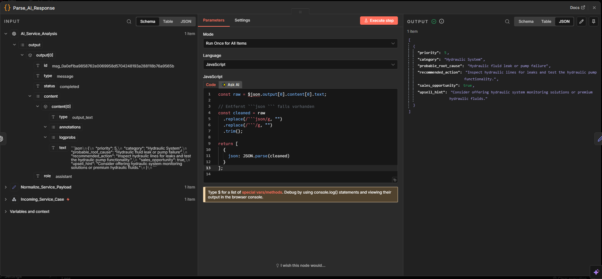
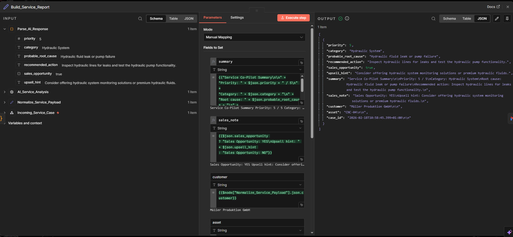
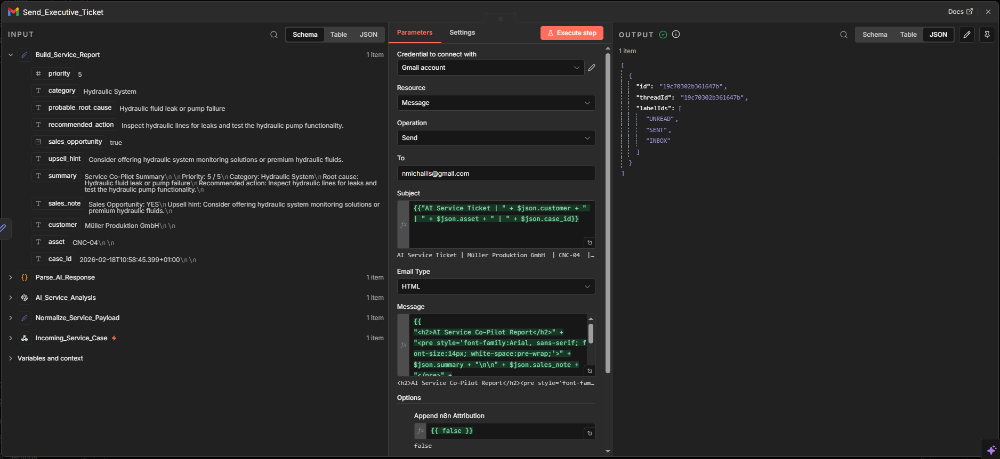
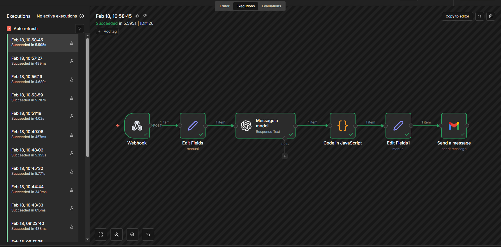
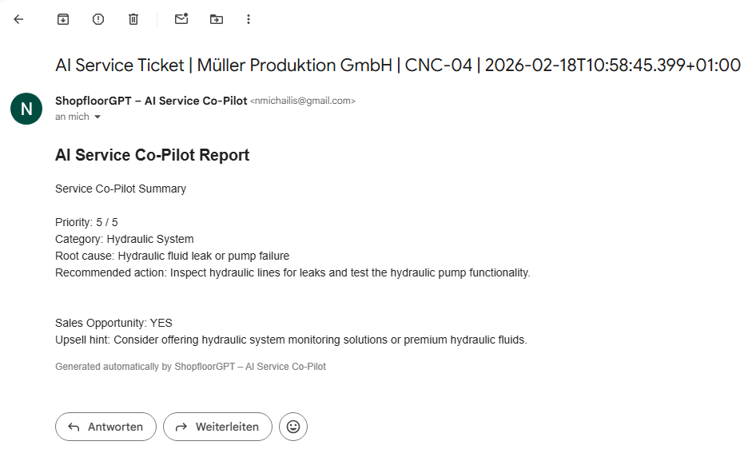

# ai-service-co-pilot
AI-powered industrial service case triage, technical assessment & executive ticket generation using n8n and OpenAI.

---

# 🚀 AI Service Co-Pilot (Service Case → AI Analysis → Executive Ticket)

An AI-powered industrial service automation workflow built using **n8n** and **OpenAI**.

This demo shows how incoming machine service cases can be automatically analyzed, prioritized, commercially evaluated, and converted into a structured **executive-ready service ticket email** — without manual triage.

---

# 🧠 Overview

The system simulates a production-ready **industrial service intake pipeline**:

1) Service case comes in via webhook  
2) Payload normalization (SAP-ready structure)  
3) AI technical + commercial assessment  
4) Structured JSON parsing & validation  
5) Executive report formatting  
6) Automated ticket email dispatch  
7) Execution proof in n8n  

---

# 🏗 System Architecture

High-level overview of the complete n8n pipeline (end-to-end):

---

# 🔌 API / Webhook

Example API payload for incoming service cases:

---

# ⚙️ Live Workflow (Step-by-Step)

## 01) Incoming Service Case (Webhook)

Receives structured machine service cases via HTTP POST.

Typical fields:
- `case_id`
- `customer`
- `asset`
- `problem`
- `impact`

---

## 02) Normalize Service Payload

Prepares and standardizes input data before AI processing.

Ensures:
- consistent naming
- clean structure
- reliable downstream parsing

---

## 03) AI Service Analysis (Technical + Commercial)

OpenAI performs structured service triage and returns **strict JSON**:

- `priority` (1–5)  
- `category`  
- `probable_root_cause`  
- `recommended_action`  
- `sales_opportunity` (true/false)  
- `upsell_hint`  

---

## 04) Parse AI Response (JSON)

Cleans and parses the AI output to guarantee valid JSON for downstream automation.

---

## 05) Build Executive Service Report

Creates a clear, professional report including:

- Technical assessment
- Root cause hypothesis
- Recommended next actions
- Commercial evaluation
- Upsell / cross-sell hints

---

## 06) Send Executive Ticket (Email)

Automatically sends a structured HTML service ticket email including:

- Customer, Asset, Case ID (SAP-ready subject line)
- AI technical assessment
- Commercial evaluation (sales opportunity + upsell hint)

---

## 07) Execution Proof (n8n Run)

Successful end-to-end workflow execution in n8n (all steps green).

---

# 📧 Final Result – Executive Ticket Email

Example of the final generated service ticket email:

- clean executive layout  
- structured technical evaluation  
- clear prioritization  
- built-in commercial intelligence  

---

# 💼 Business Impact

- Faster service triage (no manual analysis)
- Consistent prioritization and decision quality
- Reduced technician overhead
- Immediate executive-ready reporting
- Sales opportunities detected automatically from service cases

---

# 📈 Scalability Potential

This architecture can be extended to:

- SAP / ERP ticket creation (CS/PM)
- ServiceNow / Jira ticket automation
- CRM opportunity auto-creation (HubSpot / Salesforce)
- SLA-based routing and escalation
- Spare-parts recommendations
- Maintenance contract automation
- Multi-language service reporting
- Fleet-wide dashboards & analytics

---

# 🛠 Technology Stack

- n8n (workflow orchestration)
- OpenAI API (LLM-based service analysis + recommendation)
- Webhook (real-time case ingestion)
- Gmail (automated executive ticket dispatch)

---

# 🔥 What This Demonstrates

- AI workflow orchestration end-to-end
- Structured LLM output enforcement (strict JSON)
- Industrial service triage logic
- Commercial opportunity detection
- Executive-ready automation design
- Production-style pipeline structure

